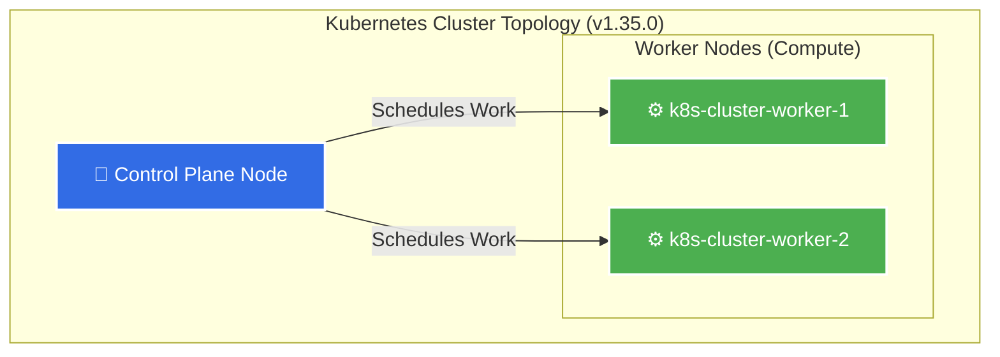
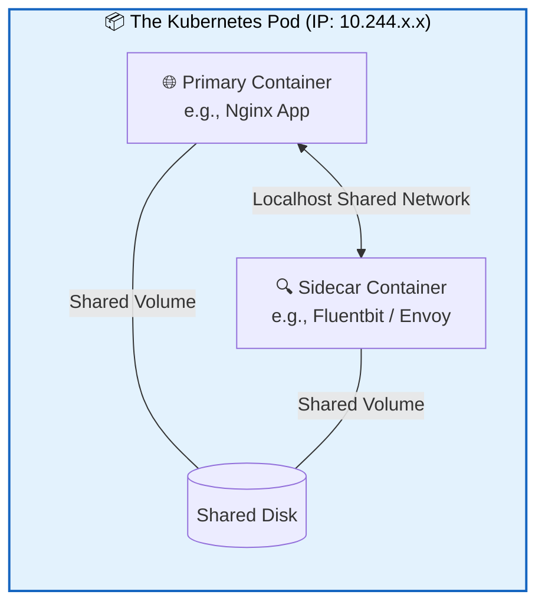

# ☸️ Kubernetes Learning Hub (Part 1: Core Primitives)


---

## 📖 Project Overview

Welcome to the **DevOpsBrothers Kubernetes Learning Hub**. This repository serves as a practical foundation for understanding how Kubernetes works beneath the surface. It transitions away from standard container management and focuses entirely on the declarative **Desired State Reconciliation Engine**.

### The Cloud-Native Philosophy (The Layman's Explanation)
* **Containers (Docker):** Like individual engines. They run well alone but don't know how to talk to each other or fix themselves if they break.
* **Pods:** The smallest unit Kubernetes understands. Think of a Pod as a tightly wrapped package that contains one or more containers (engines) sharing the same network.
* **Kubernetes:** The automated factory manager. You don't tell Kubernetes *how* to build the factory; you just tell it *what* the factory should look like (Declarative State), and it continuously fixes the floor until it matches your blueprint.

---

## 🗺️ Table of Contents
* [1. Cluster Topology](#1-cluster-topology)
* [2. The Pod Architecture](#2-the-pod-architecture)
* [3. Core Primitives & Deployment Files](#3-core-primitives--deployment-files)
* [4. Getting Started (Installation)](#4-getting-started-installation)
* [5. Production Best Practices](#5-production-best-practices)

---

## 1. Cluster Topology

This learning lab is built on a standard multi-node setup. Below is the visualization of how the control plane interacts with the worker nodes.



**Cluster Status Command:**

```bash
kubectl get nodes

```

---

## 2. The Pod Architecture

A Pod is the smallest deployable compute unit that you can create and manage in Kubernetes.

### Multi-Container Pods (The Sidecar Pattern)

Sometimes, containers need to be tightly coupled. Below is a representation of how multiple containers interact inside a single Pod.



> **Crucial Rule of Pods:** Pods are **ephemeral** (disposable). Treat them like cattle, not pets. Never rely on a Pod's local IP or filesystem for permanent data.

---

## 3. Core Primitives & Deployment Files

This repository contains YAML manifests covering the foundational Kubernetes objects:

| Object | YAML File | Purpose |
| --- | --- | --- |
| **Pod** | `nginx-pod.yml` | Deploys a standalone Nginx container. Useful for basic testing, but not used directly in production. |
| **ReplicaSet** | `ReplicaSet.yml` | Ensures a specified number of pod replicas are running at any given time. |
| **Deployment** | `Deployment.yml` | The production standard. Manages ReplicaSets and provides declarative updates (Rolling Updates). |
| **Service** | `svc.yml` | Provides stable networking (stable IP/DNS) to an ephemeral set of Pods using Label Selectors. |
| **Data Store** | `redis.yml` | A basic Redis deployment demonstrating stateful caching configurations. |

---

## 4. Getting Started (Installation)

To get this cluster running on a fresh Linux server (e.g., AWS EC2), use the provided shell scripts.

### Step 1: Install Dependencies (Docker)

```bash
chmod +x install_docker.sh
./install_docker.sh

```

### Step 2: Provision the Cluster (Kind)

```bash
chmod +x kind_install.sh
./kind_install.sh

```

### Step 3: Verify the Environment

```bash
# Check uptime and system time
uptime -p
timedatectl

# View all running pods with extended IP information
kubectl get pods -o wide

```

---

## 5. Production Best Practices

These are essential mental models established in this repository:

1. **Timezones:** Production servers should remain in `UTC` to ensure consistent logging across distributed microservices.
2. **Immutability:** Do not manually edit running containers (e.g., `kubectl exec`). If configuration needs changing, update the YAML manifest and let the Deployment controller recreate the Pods.
3. **Labels & Selectors:** Kubernetes controllers do *not* care about Pod names. They only query: *"Which pods match my label selector?"* Proper tagging (`app: frontend`, `env: prod`) is the most important part of cloud-native architecture.


